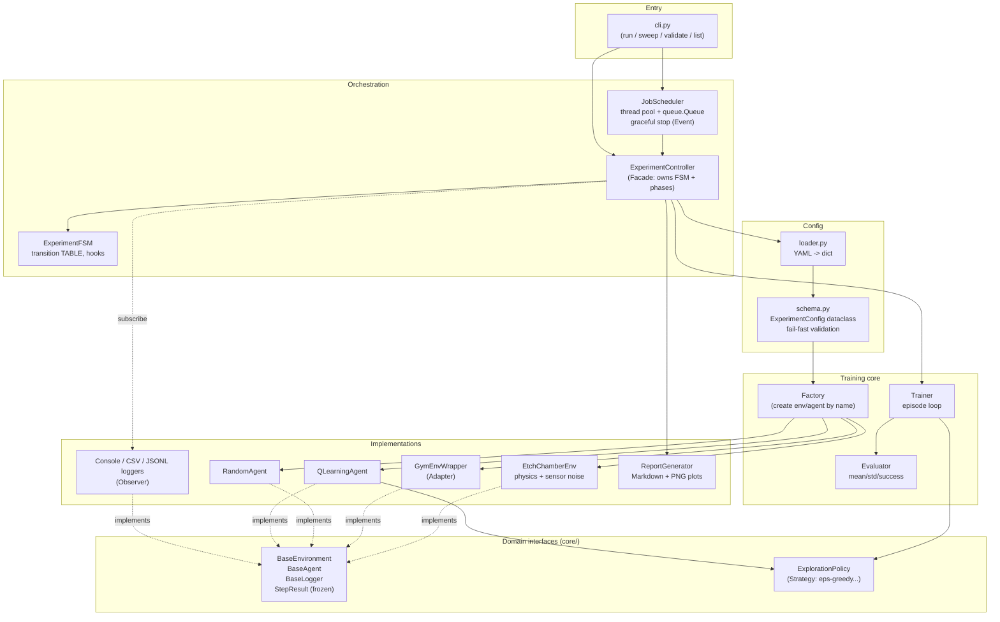
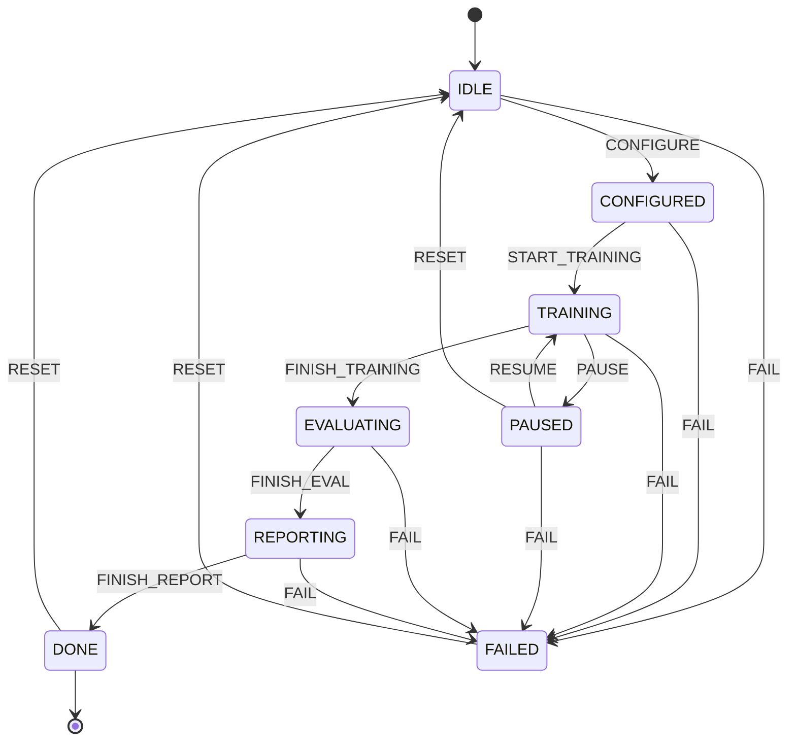
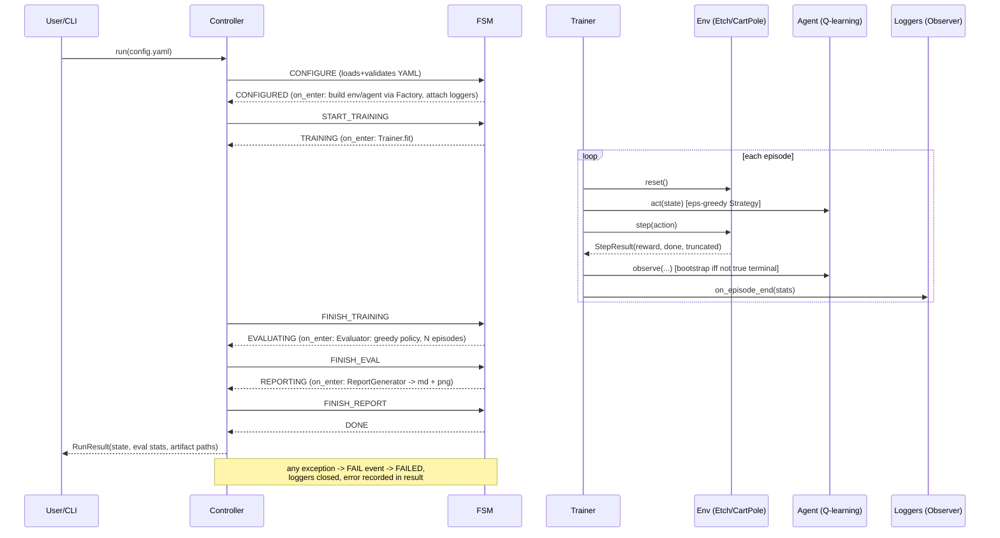

# Architecture

## Component diagram

Dependency rule (clean architecture): arrows point inward. `core/` knows
nothing about YAML, threads, matplotlib or gymnasium; those are mechanisms
injected from the outside.

## Experiment lifecycle FSM

Any (state, event) pair absent from the table raises
`IllegalTransitionError` naming the state, the event, and the legal
alternatives. Note there is no arrow out of DONE except RESET -- you cannot
"resume" a finished experiment; you start a new run object.

## One full experiment run (sequence)

## Design patterns used

| Pattern | Where | Why here / elsewhere |
|---|---|---|
| Strategy | `BaseAgent`, `ExplorationPolicy` | swap random/eps-greedy/softmax without touching Trainer. Same pattern as sorting comparators, payment providers. |
| Factory | `rl_lab/factory.py` | build env/agent from config strings; new types = one registration line. Like DB connection factories, serializer registries. |
| Adapter | `GymEnvWrapper` | third-party Gymnasium API -> our StepResult contract without forking it. Like logging shims, legacy-API gateways. |
| Observer | `BaseLogger` subscribers on controller events | CSV/JSON/console decoupled from training loop. Like event buses, webhooks, pub-sub brokers. |
| FSM (table-driven) | `core/fsm.py` | legality as data, not scattered ifs. Recipe sequencers in wafer fabs use exactly this to prevent illegal tool states. |
| Facade | `ExperimentController` | hides FSM+trainer+evaluator+report wiring behind one `run()`. Like a compiler driver API. |
| Template Method | FSM `on_enter/on_exit` hooks | control flow fixed, phase work injected. Like framework lifecycle callbacks (React hooks, servlet init/destroy). |
| Producer/Consumer | `JobScheduler` queue + workers | stdlib-verified queue instead of hand-rolled deque+Lock. Job queues everywhere in equipment automation. |
