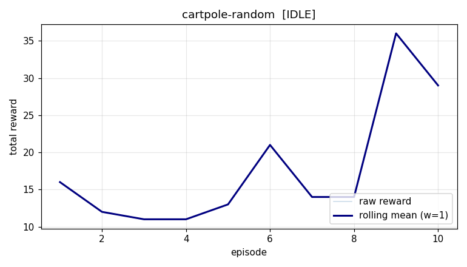

# Experiment report: cartpole-random

## Configuration

| key | value |
|---|---|
| env | `gym:CartPole-v1` |
| agent | `random` |
| seed | 7 |
| episodes | 10 |
| max_steps | 200 |
| eval_episodes | 20 |

## Result

- final state: **IDLE**
- wall time: 0.0s
- eval mean reward: **22.05** (std 9.18)
- eval min/max: 10.00 / 44.00
- success rate: 100%
- training reward 16.0 -> 29.0 (improved)

## Learning curve

