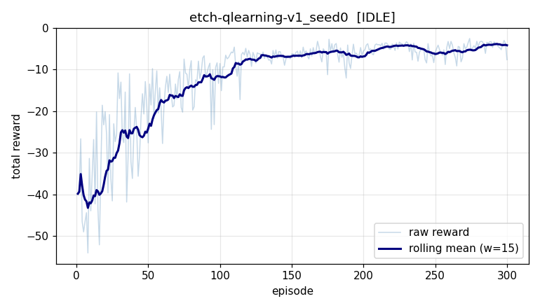

# Experiment report: etch-qlearning-v1_seed0

## Configuration

| key | value |
|---|---|
| env | `etch_chamber` |
| agent | `qlearning` |
| seed | 0 |
| episodes | 300 |
| max_steps | 100 |
| eval_episodes | 20 |

## Result

- final state: **IDLE**
- wall time: 0.0s
- eval mean reward: **-4.56** (std 0.00)
- eval min/max: -4.56 / -4.56
- success rate: 100%
- training reward -39.9 -> -7.7 (improved)

## Learning curve

