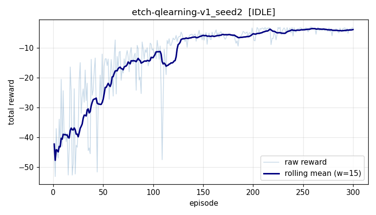

# Experiment report: etch-qlearning-v1_seed2

## Configuration

| key | value |
|---|---|
| env | `etch_chamber` |
| agent | `qlearning` |
| seed | 2 |
| episodes | 300 |
| max_steps | 100 |
| eval_episodes | 20 |

## Result

- final state: **IDLE**
- wall time: 0.0s
- eval mean reward: **-3.02** (std 0.00)
- eval min/max: -3.02 / -3.02
- success rate: 100%
- training reward -42.3 -> -3.2 (improved)

## Learning curve

