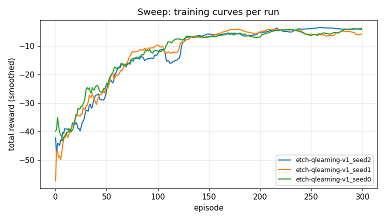

# Sweep report

| run | state | eval mean | std(within) | success | wall(s) |
|---|---|---|---|---|---|
| etch-qlearning-v1_seed2 | DONE | -3.02 | 0.00 | 100% | 7.2 |
| etch-qlearning-v1_seed1 | DONE | -3.79 | 0.00 | 100% | 7.3 |
| etch-qlearning-v1_seed0 | DONE | -4.56 | 0.00 | 100% | 7.3 |

Aggregate over 3 scored runs: mean=-3.79, std_across_seeds=0.77

## Aggregate

- scored runs: 3/3
- mean eval reward: -3.79
- std across seeds: 0.77
- mean success rate: 100%
- failed runs: 0
